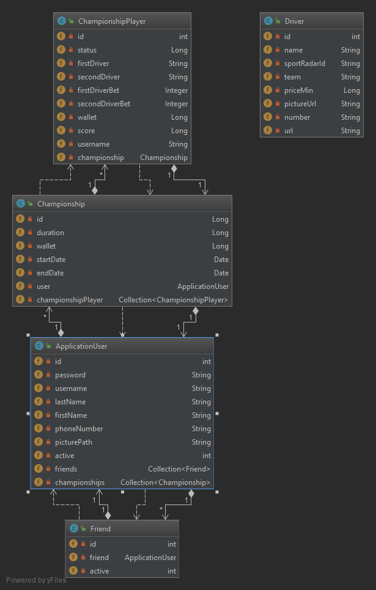

# Introdution
The aim of this Software Architecture Specifications (SAS) is to present the technical elements necessary for the **MyLittleBike** project.

# Server deployement
## Prerequisite
The user will have to Download:
- Java Developement Kit 8
- Gradle
## Build and Launch
- Go to the root folder of your project
- Run : gradle build && cd build/libs
- Run : java -jar server.jar

# Global architecture
There is the UML which represents all MyLittleBike Application objects. For more information about controllers and services, please take a look at server/doc/index.html file.

# REST Documentation

| Title | Path | Method | URL param | Header | Body | Success | Failure |
|---|---|---|---|---|---|---|---|
| Connection | /login | POST | / | Content-type: application/json | / | 200: OK | 403 |
| Create account | /users/sign-up | POST | / | Content-type: application/json | **ApplicationUser** Object | 200: OK, **ApplicationUser** Object | 403 |
| Update account | /users | PUT | / | Content-type: application/json, Authorization : token | **ApplicationUser** Object | 200: OK, **ApplicationUser** Object | 403 |
| Get user info| /users | GET| username=[String] | Content-type: application/json, Authorization : token | **ApplicationUser** Object | 200: OK, **ApplicationUser** Object | 403 |
| Add friend | /users/friend/add | POST | friendName=[String] | Content-type: application/json, Authorization : token | / | 200: OK | 403 |
| Get friends| /users/friend | GET| username=[String] | Content-type: application/json, Authorization : token | / | 200: OK, **Friend** Object list | 403 |
| Create championship| /championship| POST| / | Content-type: application/json, Authorization : token | **Championship** Object | 200: OK, **Championship** Object | 403 |
| Get championships| /championship| GET| / | Content-type: application/json, Authorization : token | / | 200: OK, **Championship** Object list | 403 |
| Add friend to championship| /championship/addPlayer | POST| championshipId=[Long], wallet=[Long], username=[String] (username of the friend) | Content-type: application/json, Authorization : token | / | 200: OK | 403 |
| Bet on driver| /championship/bet| POST| championshipId=[Long], price=[Integer], driverId=[String] | Content-type: application/json, Authorization : token | / | 200: OK, **Map<String, String>**, if bet continue. else: **null** | 403 |
| Get MotoGP driver list| /championship/driver| GET| /| Content-type: application/json, Authorization : token | / | 200: OK, **Driver** Object list | 403 |
